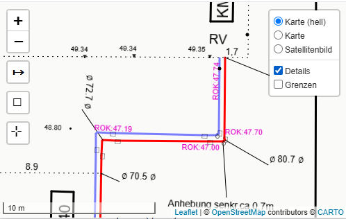
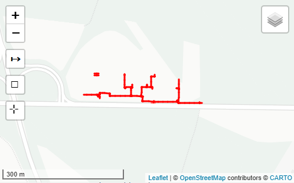
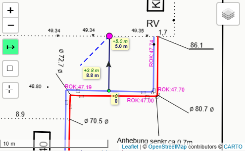
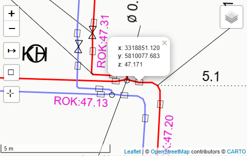

# GIS DXF online Viewer

* GIS - Geo Information System
* DXF - Data exchange Formate
    * Is an export format of common GIS software

Utility documentation and DXF viewer for field use.

*Note: this is a DEMO file*

## Overview

This project imports DXF files and presents them in a web-based viewer for quick access in the field.

It is designed for:
- DXF / MAP viewing
- GIS-based location and asset documentation
- field use on tablets, laptops, or mobile devices
- simple measurement and map-view workflows

## What it is

- DXF (Data Exchange Format) viewer
- GIS-oriented web viewer for infrastructure plans
- lightweight field tool for working with maps and utility layouts
- suitable for documentation and quick inspections on site

## Use Cases

### Field use
- Find cables or pipes in the middle of a field using GPS position
- Quickly answer questions such as: how deep is the pipe, where is it, what type or size is it?
- Reduce the need for costly probing and excavation
- Minimize the risk of damaging other cables or utilities during digging
- Support documentation of installed infrastructure
- Simplify field workflows with minimal measurement tools and different map views

### Typical applications
- District heating networks
- Utility lines
- Boundaries
- Parcels

## Working modes

- Online view
- Offline use with downloaded data
- Serverless backup workflow using USB drives and portable data
- Simple field usage for construction and site operations

### Features

- works offline without network connection
    - can also run direct from backup or drive (USB/CD)
    - Just run with Javascript
- simpler overview map
- three different backgound maps -> from leaflet
    - light color
    - openstreetmap
    - Satelite picutures
- GPS localisation 
    - The maps centers on you current device location
- Distance measurment tool
- Show Coordinates

## Scope

This is not an engineering tool. It is intended for practical field work in dirty, outdoor construction environments where quick and simple access to plan information is required. 

Optimiesed to work on also on mobile devices with limit power.

## Goals

- Simple to use
- Fast to access
- Useful in the field
- Suitable for documentation and operational awareness
- Support for utility and construction site workflows

## Technology focus

- DXF import
- GIS data handling
- Web viewer experience
- map visualization
- lightweight field-oriented interface

## Example Workflow

1. Import DXF files into the app and convert it into a json file
2. Load the json plan into the web viewer
3. Use GPS or map navigation to locate assets
4. Inspect details and measurements
5. Record and document information for field operations

## Notes

This repository is aimed at practical, real-world field use rather than advanced engineering calculations or design tasks.

This was developed as **Proof of Concect**.